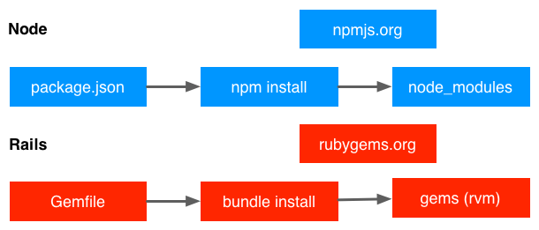
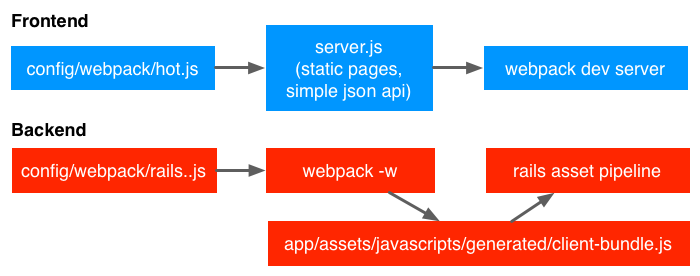

# Webpack::Rails

Webpack for Rails in hybridization or replacement way.

## Advantage

Managing libraries with [bundler](https://github.com/bundler/bundler) and [npm](https://github.com/npm/npm) would make project more convenient and consistent.



The frontend and backend team could work together more smoothly with [webpack](https://github.com/webpack/webpack) in one project.



## Installation

Add this line to your application's Gemfile:

```ruby
gem 'golden-webpack-rails'
```

And then execute:

```
$ bundle
```

## Usage

### Hybridization mode

In your application root path, execute generator with a perfered path name like `client`.

```
$ bundle exec rails generate webpack:install client
```

It will create a `client` path to be your webpack root path and install npm modules inside.

Start develop servers with [foreman](https://github.com/ddollar/foreman).

```
$ gem install foreman
$ foreman start -f Procfile.dev
```

See live reload web page in browser.

```
$ open http://localhost:4000/webpack-dev-server/
```

Happy coding with webpack.

### Replacement mode

It's still working on.

## Development

After checking out the repo, run `bin/setup` to install dependencies. Then, run `rake spec` to run the tests. You can also run `bin/console` for an interactive prompt that will allow you to experiment.

To install this gem onto your local machine, run `bundle exec rake install`. To release a new version, update the version number in `version.rb`, and then run `bundle exec rake release`, which will create a git tag for the version, push git commits and tags, and push the `.gem` file to [rubygems.org](https://rubygems.org).

## Contributing

Bug reports and pull requests are welcome on GitHub at https://github.com/goldenio/webpack-rails. This project is intended to be a safe, welcoming space for collaboration, and contributors are expected to adhere to the [Contributor Covenant](contributor-covenant.org) code of conduct.

## Acknowledgement

This gem is inspired by [Fast Rich Client Rails Development With Webpack and the ES6 Transpiler](http://forum.railsonmaui.com/t/fast-rich-client-rails-development-with-webpack-and-the-es6-transpiler/327) and [it's tutorial](https://github.com/shakacode/react-webpack-rails-tutorial).

## License

The gem is available as open source under the terms of the [MIT License](http://opensource.org/licenses/MIT).

